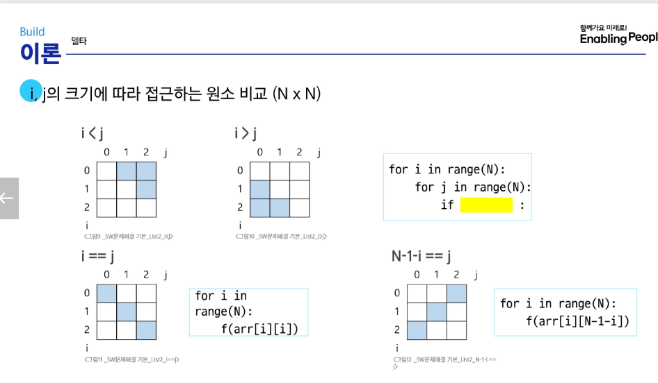

# 목차

1. 2차원 List
    1. 2차원 배열
    2. 델타
    3. 연습문제
    4. 부분집합
2. 검색과 정렬
    1. 순차검색
    2. 이진 검색 (Binary Search)
    3. 선택 정렬 (Selection Sort)
    4. 셀렉션 알고리즘 (Selection Algorithm)

# 1. 2차원 배열

### 2차원 배열의 선언

1차원 List를 묶어놓은 List

2차원 이상의 다차원 List는 차원에 따라 Index를 선언

2차원 List의 선언 : 세로길이(행의 개수), 가로길이(열의 개수)를 필요로 함

arr = [[0,1,2,3],[4,5,6,7]]  (2행 4열의 2차원 List)

### 입력을 2차원 배열에 저장하기

```python
# 입력 예시 
3
1 2 3
4 5 6
7 8 9

N = int(input)
arr = [list(map(int, input().split())) for _ in range(N)]
```

```python
# 입력 예시
3
123
456
789

N = int(input)
arr [list(map(int, input())) for _ in range(N)]
```

### 0으로 채워진 3x4 배열 만들기

```python
arr = [[0] * 4 for _ in range(3)]

# range(N) 에서 N에 행이 들어감

arr2 = [[0] * 4] * 3 

# arr2은 얕은 복사가 되어버림
```

### 배열 순회

n * m 배열의 모든 원소를 빠짐없이 조회하는 방법

## 1. 행 우선 순회

```python
# i 행의 좌표
# j 행의 좌표

for i in range(n):
	for j in range(m):
		f(array[i][j]) # 필요한 연산 수행
		
# 0 0 
# 0 1
# 0 2 
```

### 행의 합 중에 최댓값은?

```python
for i in range(N):
	max_v = 0
	s = 0
	for j in range(M):
		s += arr[i][j]
		
	if max_v < s:
		max_v = s
```

### N x M 배열의 크기와 저장된 값이 주어질 때 합을 구하는 방법

```python
# 3 4
# 1 7 2 8
# 6 2 9 3
# 5 7 4 2

N, M = map(int, input().split())
arr = [list(map(int, input().split())) for _ in range(N)]

s = 0

for i in range(N):
	for j in range(M):
		s += arr[i][j]
```

## 2. 열 우선 순회

```python
# i 행의 좌표
# j 열의 좌표

for j in range(m) :
	for i in range(n) :
		f(array[i][j])
		
# 0 0 1 0 2 0
```

고정하는 친구를 밖에 for문에다 씀.

내가 열을 고정하고 싶다? 열은 M임. 따라서 밖에 for문 range m 으로 설정.

## 3. 지그재그 순회

```python
# i 행의 좌표
# j 열의 좌표

for i in range(n) :
	for j in range(m) :
		f(array[i][ j + (m-1-2*j) * (i%2)])
```

1. if 문으로 해결

짝수 일 때는 오른쪽으로

홀수 일 때는 왼쪽으로

1. for문으로 해결

0 1 2 3

3 2 1 0

0 1 2 3

위 아래 합이 3으로 고정이네?

홀 수 일때는 m-1 - j 를 남겨야하네?

근데 지금 왼쪽 j를 이미 더했지? 그러니까 j를 한번 더 빼야해.

따라서 m-1 - 2j 가 되는데j

이게 홀수일 때는 남겨야하고

짝수일 때는 없어저야하네.

그러니까 i%2 로 짝수일 때는 0 

홀 수 일때는 1의 값으로 곱해주면 되겠네.

따라서 f(array[i][j + (m-1-2j)* (i%2)])

# 2. 델타

### 델타를 활용한 2차원 배열 탐색

2차 배열의 한 좌표에서 4방향의 인접 배열 요소를 탐색하는 방법

인덱스 (i, j)인 칸의 상하좌우 칸 (ni, nj)

```python
di[] <- [0, 1, 0, -1] # 방향별로 더할 값
dj[] <- [1, 0, -1, 0]

# 3시 시계방향으로 0번방 
# 6시 1번방
# 9시 2번방
# 12시 3번방

for k : 0 -> 3
	ni <- i + di[k]
	nj <- j + dj[k]
```

2차 배열의 한 좌표에서 4방향의 인접 배열 요소를 탐색하는 방법

```python
arr[0...N-1][0...N-1] # N x N 배열
di[] <- [0, 1, 0, -1]
dj[] <- [1, 0, -1, 0]
for i : 0 -> N-1
	for j : 0 -> N-1
		for d in range(4) :
			ni <- i + di[d]
			nj <- j + di[d]
			if 0 <= ni < N and 0 <= nj < N # 유효한 인덱스면
				f(arr[ni][nj])
```

### 델타 응용

N x M 배열에서 각 원소를 중심으로, 상하좌우 k칸의 합계 중 최대값( k=2)

```python
max_v= 0
for i in range(N):
	for j in range(N):
		s = arr[i][j] # i, j를 중심으로
		for di, dj in [[0,1],[1,0],[0,-1],[-1,0]]: # 각 방향
			for c in range(1, k+1)
				ni, nj = i+di*c, j+dj*c
					if 0 <= ni < N and 0 <= nj < N:
						s += arr[ni][nj]
						
		if max_v < s:
				 max_v = s
```

### 전치 행렬

```python
# i : 행의 좌표, len(arr)
# j : 열의 좌표, len(arr[0])
arr = [[1,2,3],[4,5,6],[7,8,9]] # 3*3 행렬

for i in range(3) :
	for j in range(3) :
		if i < j :
			arr[i][j], arr[j][i] = arr[j], arr[i][j]
```


# 3. 연습 문제

### 연습 문제 1

5x5 2차원 배열 25개 숫자 저장하고

대각선 원소의 합을 구하시오

```python
s = 0
for i in range5):
	s += arr[i][i]
	s += arr[i][4-i]
	
s -= arr[2][2]
```

### 연습 문제2

25개의 각 요소에 대해서 그 요소와 이웃한 요소와의 차의 절대값을 구하시오.