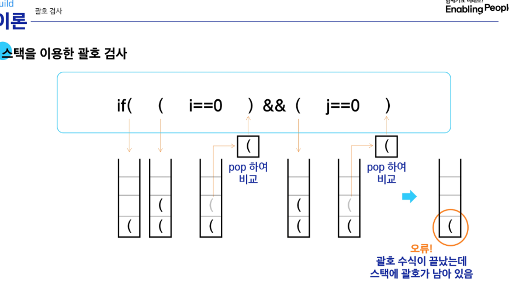
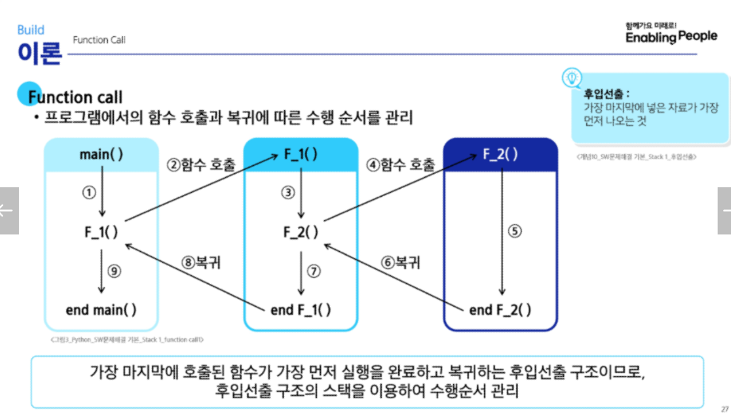

# 목차

1. Stack 자료구조 이해
    1. Stack의 개념과 특성
    2. Stack의 기본 연산
    3. Stack 구현 실습
2. Stack 응용
    1. 괄호 검사
    2. Fucntion Call
3. Stack 기반 문제 해결 기법
    1. 재귀호출
    2. Memoization
    3. DP
    4. DFS

# 1. Stack의 개념과 특성

물건을 쌓아 올리듯 자료를 쌓아 올린 형태의 자료구조

대표적인 선형 자료구조 중 하나

### 스택의 특성

후입선출 : LIFO, Last-In-First-Out

# 2. Stack의 기본 연산

`push` : 삽입. 

`pop` : 삽입한 자료 역순 출력 및 삭제

`isEmpty` : 스택이 비어 있으면 True, 아니면 False

`peek` : 스택의 top에 있는 원소(item) 반환. 삭제는 하지 않음

# 3. Stack 구현 실습

### Push 연산

```python
# append 메소드를 통해 리스트의 마지막에 데이터 삽입

def my_push(item) :
	s.append(item)
```

```python
# 인덱스 연산을 활용한 구현
def my_push(item, size):
	global top
	top += 1
	if top == size:
		print('overflow!')
	else:
		stack[top] = item
		
size = 10
stack = [0] * size
top = -1

push(10, size) # 격식을 갖추면
top += 1        # push(20)
stack[top] = 20 #
```

### Pop 연산

```python
def my_pop() :
	if len(s) == 0 :
		# underflow
		return
	else :
		return s.pop()
```

```python
def my_pop() :
	global top
	if top == -1 :
		print('underflow')
		return 0
	else :
		top -= 1
		return stack[top+1]
		
print(pop())
```

```python
if top > -1 : # pop()
	top -= 1
	print(stack[top+1])
```

### 스택 구현 고려 사항

- 1차원 배열을 사용하여 구현할 경우
    - 장점 : 구현 용이
    - 단점 : 스택 크기를 변경하기 어려움
- 해결 방법: 저장소를 동적으로 할당하여 스택을 구현하는 방법
    
    (동적 연결리스트를 이용하여 구현하는 방법)
    
    - 장점 : 메모리 효율적으로 사용
    - 단점: 구현 복잡

### 연습문제 1

```python
stack = []
stack.append(1)
stack.append(2)
stack.append(3)

print(stack.pop())
print(stack.pop())
print(stack.pop())
```

```python
top = -1
stack = [0] * 10

top += 1    # push(1)
stack[top] = 1
top += 1    # push(2)
stack[top] = 2
top += 1    # push(3)
stack[top] = 3

top -= 1    # pop()
print(stack[top+1])
top -= 1    # pop()
print(stack[top+1])
top -= 1    # pop()
print(stack[top+1])
print(stack)  # [1, 2, 3, 0, 0, 0, 0, 0, 0, 0]
print(top)    # -1
```

# 4. 괄호 검사

```python
if( ( i == 0 ) && ( j == 0 )
```



     2         4

1    1    1    1    1

### 괄호검사 알고리즘

1. 문자열에 있는 괄호를 차례대로 검사하면서 왼쪽 괄호를 만나면  스택에 삽입하고, 오른쪽 괄호를 만나면 스택에서 top 괄호를 삭제한 후 오른쪽 괄호와 짝이 맞는지를 검사한다.
    1. 이 때, 스택이 비어 있으면 조건 1 또는 조건 2에 위배되고 괄호의 짝이 맞지 않으면 조건 3에 위배된다.
2. 마지막 괄호까지 조사한 후에도 스택에 괄호가 남아 있다면 조건 1에 위배된다.

조건 1 : 개수 같게

조건 2 : 왼쪽 괄호가 먼저 나와야함

조건 3 : 포함관계

```python
txt = input()

top = -1
stack = [0] * 100

ans = 1
for x in txt:
    if x == '(':    # 여는 괄호 push
        top += 1
        stack[top] = x
    elif x == ')':  # 닫는 괄호인 경우
        if top == -1:   # 스택이 비어있으면 (여는 괄호가 없으면 )
            ans = 0
            break   # for x
        else:           # 여는 괄호 하나 버림
            top -= 1    # pop
if top != -1:   # 여는 괄호가 남아있으면
    ans = 0

print(ans)
```

```python
pair = {'(':')', '{':'}','[':']'}
txt = input()

top = -1
stack = [0] * 100

ans = 1
for x in txt:
    if x in ['(','{','[']:    # 여는 괄호 push
        top += 1
        stack[top] = x
    elif x in [')','}',']']:  # 닫는 괄호인 경우
        if top == -1:   # 스택이 비어있으면 (여는 괄호가 없으면 )
            ans = 0
            break   # for x
        else:           # 짝 확인
            top -= 1    # pop
            y = stack[top+1]
            if  pair[y] != x :
	            ans = 0
	            break
            
if top != -1:   # 여는 괄호가 남아있으면
    ans = 0

print(ans)
```

# 5. Function call



# 6. 재귀호출

함수가 자신과 같은 작업을 반복해야 할 때, 자신을 다시 호출하는 구조

```python
# 피보나치 수열
def fibo(n) :
	if n < 2 :
		return n
	else :
		return fibo(n-1) + fibo(n-2)
```

```python
# 재귀함수의 기본형
def f(i, N):
	if i == N: # 중단조건
		return
	else:   # 재귀호출
		f(i+1, N)
```

### 모든 배열 원소에 접근하는 재귀함수

```python
def f(i, N) : # 크기 N인 배열 arr[i]에 접근
	if i == N :
		return
	else :
		print(arr[i])
		f(i+1, N)
```

### 배열 원소 v 검색

```python
def f(i, N, v) : # v 찾는 값
	if i == N :
		return 0
	elif arr[i] == v: 
		return 1         # v를 찾은 경우에도 재귀호출을 중단
	else :
		retuen f(i+1, N, v)
```

# 7. Memoization

- 피보나치 재귀호출의 문제점

엄청난 중복 호출이 존재.

이러한 문제를 해결하기 위해 고안된 방법

- 재귀 알고리즘 최적화

컴퓨터 프로그램을 실행할 때 이전에 계산한 값을 메모리에 저장해서

매번 다시 계산하지 않도록 하여 전체적인 실행속도를 빠르게 함.

### Memoization을 적용한 피보나치

```python
# memo를 위한 배열을 할당하고, 모두 0으로 초기화
# memo[0]을 0으로 memo[1]는 1로 초기화

def fibo1(n):
	if n >= 2 and memo[n] == 0 :
		memo[n] = fibo1(n-1) + fibo1(n-2)
	return memo[n]
	
memo = [0] * (n+1)
memo[0] = 0
memo[1] = 1
```

`memo[m]`  0 이 아니라면, 함수를 실행하지 않는다는 차이점!

# 8.  DP (동적계획법)

입력 크기가 작은 부분 문제들을 먼저 해결한 뒤, 

그 결과를 바탕으로 

더 큰 부분 문제를 순차적으로 해결해 나가며 

최종적으로 전체 문제의 해답을 도출하는 알고리즘

- 동적 계획 알고리즘은 그리디 알고리즘과 같이 최적화 문제를 해결하는 알고리즘

### 피보나치 수열을 DP로 구현한 코드

- 문제의 최적 해가 그 하위 문제의 최적 해로부터 쉽게 구성될 수 있는 최적 부분구조여야함.
- 동일한 하위 문제가 여러 번 반복되어 나타나는 중복 부분 문제여야함.

```python
def fibo2(n) :
	f = [0] * (n+1)
	f[0] = 0
	f[1] = 1
	for i in range(2, n + 1) :
		f[i] = f[i-1] + f[i-2]
		
	return f[n] # f[i]가 아니라 n을 구하는 거임!!
	
```

- 부분 문제로 나누는 일을 끝냈으면 가장 작은 부분 문제부터 해 구하기
- 그 결과는 테이블에 저장하고, 테이블에 저장된 부분 문제의 해를 이용하여 상위 문제의 해를 구하기

재귀 구조에 Memoization을 사용하는 것보다, 반복적인 구조로 DP를 구현하는 방식이 성능 면에서 더 효율적. 

재귀적 구조는 내부에 시스템 호출 스택을 사용하는 오버헤드가 발생하기 때문

fibo(7) = fibo (6) + fibo(5)

근데 fibo(7) 을 구할 때의 fibo(6)이

fibo(6)을 구할 때의 fibo(6)이랑 같다는 아이디어.

총 n번의 반복문으로 해결!

<aside>
💡
 재귀함수는 다른 함수를 호출하는 방식이고,
 DP는 반복문을 사용한다.

</aside>

# 9. DFS (깊이 우선 탐색)

비선형구조인 그래프 구조는 그래프로 표현된 모든 자료를 빠짐없이 검색하는 것이 중요.

이러한 탐색에는 다음의 두 가지 방법이 사용됨

1. 깊이 우선 탐색(De[th First Search, DFS)
2. 너비 우선 탐색(Breadth First Search, BFS)

### DFS의 동작 원리

1. 시작 정점의 한 방향으로 갈 수 있는 경로가 있는 곳까지 깊이 탐색해 나간다.
2. 더 이상 갈 곳이 없게 되면, 가장 마지막에 만났던 갈림길 간선이 있는 정점으로 되돌아와서 다른 방향의 정점으로 탐색을 계속 반복하여 결국 모든 정점을 방문하는 탐색 방법

<aside>
💡

가장 마지막에 만났던 갈림길의 정점으로 되돌아가서

다시 깊이 우선 탐색을 반복해야 하므로 

후입선출 (LIFO) 구조의 스택 사용

</aside>

### DFS 알고리즘

1. 시작 정점 v를 결정하여 방문한다.
2. 정점 v에 인접한 정점 중에서
    1. 방문하지 않은 정점 w가 있으면,
    정점 v를 스택에 push하고 정점 w를 방문한다.
    그리고 w를 v로 하여 다시 2번을 반복한다.
    2. 방문하지 않은 정점이 없으면, 탐색의 방향을
    바꾸기 위해서 스택을 pop하여 받은 가장 마지막
    방문 정점을 v로 하여 다시 2번을 반복한다.
3. 스택이 공백이 될 때까지 2를 반복한다.

### 슈도코드

```python
visited[], stack[] 초기화
DFS(v)
	시작점 v 방문;
	visited[v] <- True;
	while {
		if (v의 인접 정점 중 방문 안 한 정점 w가 있으면)
			push (v) ;
			v <- w; (w에 방문)
			visited[w] <- true
		else
			if (스택이 비어 있지 않으면)
				v <- pop(stack);
			else
				break
	}
end DFS()
```